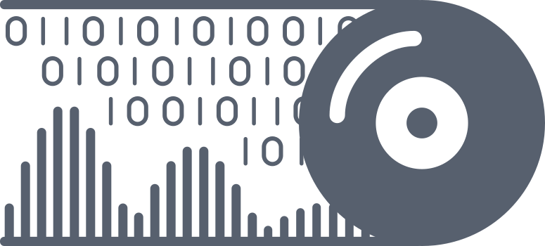

<p float="left">
  
  
</p>

# ZL Equalizer

[](https://opensource.org/license/agpl-v3)
[](https://somsubhra.github.io/github-release-stats/?username=ZL-Audio&repository=ZLEqualizer&page=1&per_page=30)

ZL Equalizer is an equalizer plugin.

A short intro video is available at [here](https://www.youtube.com/watch?v=bC-mBDumzvU).


## Usage

See the wiki for details.

## Download

See the releases for the latest version. 

**Please NOTICE**:
- the installer has **NOT** been notarized/EV certificated on macOS/Windows
- the plugin has **NOT** been fully tested on DAWs

## Build from Source

### Install Dependencies

Please make sure `Clang` (`AppleClang 16+` or `LLVM/Clang 17+`), `cmake` (minimum 3.25), `ninja` are installed and configured on your OS.

On Windows (with Intel chips), you may install Intel® Integrated Performance Primitives and set its path as an environment variable `IPP_DIR`. It is not a hard requirement as KFR has already been used for SIMD/DFT acceleration.

On Linux, you can install the remaining dependencies with the following command:

```console
sudo apt-get update && sudo apt install libasound2-dev libx11-dev libxinerama-dev libxext-dev libfreetype-dev libfontconfig1-dev libwebkit2gtk-4.1-dev libglu1-mesa-dev
```

### Clone and Build

Once you have set up the environment, you can clone the ZL Equalizer code, populate all submodules, then configure & build the code. Please set the variable `ZL_JUCE_FORMATS` as a list of formats that you want, e.g., `"VST3;LV2"`.
```console
git clone https://github.com/ZL-Audio/ZLEqualizer
cd ZLEqualizer
git submodule update --init --recursive
cmake -B Builds -G Ninja -DCMAKE_BUILD_TYPE=Release -DKFR_ENABLE_MULTIARCH=OFF -DZL_JUCE_FORMATS="VST3;LV2" .
cmake --build Builds --config Release
```
After building, the plugins should have been copied to the corresponding folders. If you want to disable the copy process, you can pass `-DZL_JUCE_COPY_PLUGIN=FALSE`, find the binary folders under `Builds/ZLEqualizer_artefacts/Release` and copy them manually.

> If there are multiple compilers on your OS, you may need to pass extra flags to maker sure that cmake uses `LLVM/Clang`. On Linux, you may pass `-DCMAKE_C_COMPILER=clang -DCMAKE_CXX_COMPILER=clang++`. On Windows, you may pass `-DCMAKE_C_COMPILER=clang-cl -DCMAKE_CXX_COMPILER=clang-cl`.

> AAX plug-ins need to be digitally signed using PACE Anti-Piracy's signing tools before they will run in commercially available versions of Pro Tools.

## License

ZL Equalizer is licensed under AGPLv3, as found in the [LICENSE.md](LICENSE.md) file. However, the [logo of ZL Audio](assets/zlaudio.svg) and the [logo of ZL Equalizer](assets/logo.svg) are not covered by this license.

Copyright (c) 2023 - [zsliu98](https://github.com/zsliu98)

JUCE framework from [JUCE](https://github.com/juce-framework/JUCE)

JUCE template from [pamplejuce](https://github.com/sudara/pamplejuce)

[nlopt](https://github.com/stevengj/nlopt) by [Steven G. Johnson](https://github.com/stevengj)

[kfr](https://github.com/kfrlib/kfr) by [KFR](https://github.com/kfrlib)

[fft-juce](https://github.com/hollance/fft-juce) by [
Matthijs Hollemans](https://github.com/hollance)

[fontaudio](https://github.com/fefanto/fontaudio) by [fefanto](https://github.com/fefanto)

[RemixIcon](https://github.com/Remix-Design/RemixIcon) by [Remix Design](https://github.com/Remix-Design)

Font from CMU Open Sans, Font Awesome and MiSans.

## References

Vicanek, Martin. *Matched One-Pole Digital Shelving Filters*. (2019).

Vicanek, Martin. *Matched Second Order Digital Filters*. (2016).

Redmon, Nigel. *Cascading filters*. (2016).

Wishnick, Aaron. *Time-Varying Filters for Musical Applications*. DAFx. (2014).

Moler, Cleve. [*Makima Piecewise Cubic Interpolation*](https://blogs.mathworks.com/cleve/2019/04/29/makima-piecewise-cubic-interpolation/). MathWorks Blogs. (2019).

[Equalize It](https://github.com/suroge/equalize_it) by [suroge](https://github.com/suroge)

[Frequalizer](https://github.com/ffAudio/Frequalizer) by [ffAudio](https://github.com/ffAudio)
